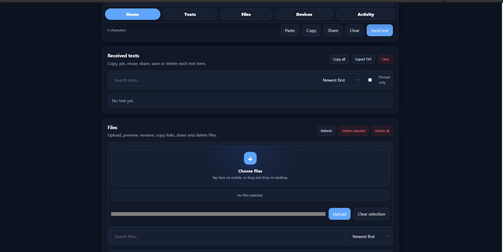
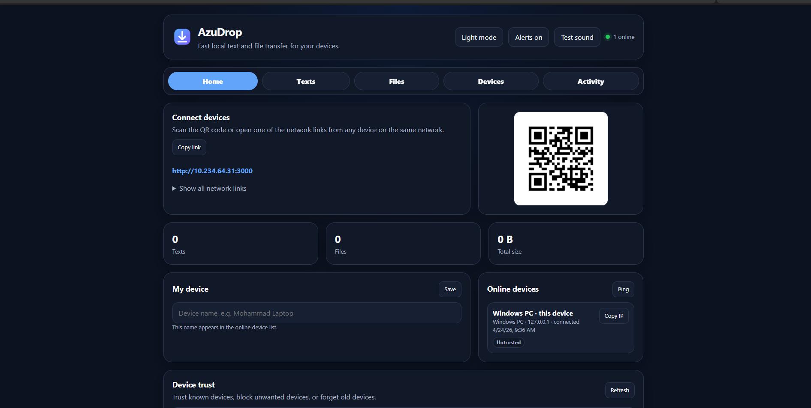
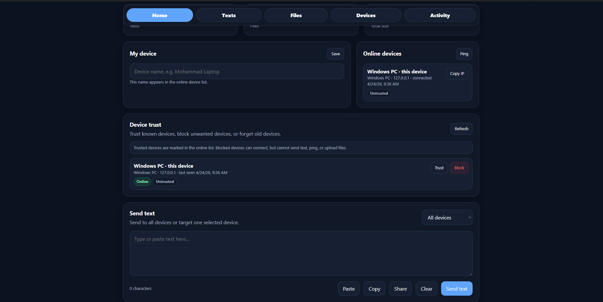

# AzuDrop

<p align="center">
  
</p>

<p align="center">
  <strong>انتقال سریع متن و فایل بین چندین دستگاه در یک شبکه محلی.</strong>
</p>

<p align="center">
  <a href="README.md">English</a> ·
  <a href="README.fa.md">فارسی</a>
</p>

<p align="center">
  <a href="#ویژگیها">ویژگی‌ها</a> ·
  <a href="#شروع-سریع">شروع سریع</a> ·
  <a href="#نکات-امنیتی">امنیت</a> ·
  <a href="#رفع-اشکال">رفع اشکال</a>
</p>

---

## معرفی

**AzuDrop** یک وب‌اپ سبک و محلی برای انتقال متن و فایل بین دستگاه‌هایی است که به یک شبکه مشترک وصل هستند.

برنامه را روی یک دستگاه اجرا می‌کنید، سپس از دستگاه‌های دیگر لینک شبکه محلی تولیدشده را باز می‌کنید یا QR Code را اسکن می‌کنید و بدون نیاز به فضای ابری، حساب کاربری یا سرور خارجی، متن و فایل جابه‌جا می‌کنید.

AzuDrop برای انتقال‌های سریع روزمره بین لپ‌تاپ، دسکتاپ، موبایل، تبلت و سایر دستگاه‌ها روی یک شبکه محلی قابل‌اعتماد طراحی شده است.

<p align="center">
  
  
  
</p>

---

## ویژگی‌ها

### اشتراک‌گذاری چنددستگاهی

- اتصال چندین دستگاه به‌صورت همزمان
- سازگار با مرورگرهای دسکتاپ و موبایل
- QR Code برای اتصال سریع
- نمایش لینک‌های شبکه محلی قابل استفاده
- نمایش لیست دستگاه‌های آنلاین همراه با نام، نوع، IP و وضعیت

### انتقال متن

- ارسال متن به همه دستگاه‌ها یا یک دستگاه مشخص
- تاریخچه متن‌های دریافت‌شده
- دکمه کپی برای هر متن
- پین کردن متن‌های مهم
- جستجو و مرتب‌سازی متن‌ها
- استفاده مجدد، اشتراک‌گذاری، ذخیره یا حذف متن‌ها
- خروجی گرفتن از تاریخچه متن‌ها به‌صورت فایل `.txt`

### انتقال فایل

- آپلود چند فایل به‌صورت همزمان
- بخش آپلود مناسب موبایل
- پشتیبانی از Drag & Drop روی دسکتاپ
- نمایش وضعیت پیشرفت آپلود
- جستجو و مرتب‌سازی فایل‌ها
- پیش‌نمایش مینیمال تصویرها
- پشتیبانی از پیش‌نمایش برخی فایل‌های رسانه‌ای رایج
- کپی لینک دانلود فایل
- اشتراک‌گذاری لینک فایل در دستگاه‌های پشتیبانی‌شده
- تغییر نام فایل‌ها
- حذف فایل‌های انتخاب‌شده یا حذف همه فایل‌ها

### Device Trust

- شناسه پایدار برای هر دستگاه در هر مرورگر
- Trust یا Untrust کردن دستگاه‌های شناخته‌شده
- Block کردن دستگاه‌های ناخواسته
- Forget کردن دستگاه‌های قدیمی
- دستگاه Block شده می‌تواند وصل شود، اما نمی‌تواند متن بفرستد، Ping ارسال کند یا فایل آپلود کند

### تجربه کاربری

- حالت روشن و تاریک
- استفاده از فونت‌های لوکال سیستم برای ظاهر طبیعی‌تر
- ناوبری تب‌محور موبایل برای دسترسی سریع به بخش‌ها
- میانبرهای ناوبری روی دسکتاپ
- نمایش محدود فعالیت‌ها به آخرین رویدادها
- اعلان صوتی همراه با دکمه تست صدا
- favicon اختصاصی SVG

---

## پیش‌نیازها

- **Node.js نسخه 18 یا جدیدتر**
- یک شبکه محلی که دستگاه‌ها بتوانند به هم دسترسی داشته باشند
- یک مرورگر مدرن روی هر دستگاه

مرورگرهای پیشنهادی:

- Chrome / Chromium
- Edge
- Firefox
- Safari

---

## شروع سریع

ریپازیتوری را کلون کنید:

```bash
git clone https://github.com/your-username/azudrop.git
cd azudrop
```

وابستگی‌ها را نصب کنید:

```bash
npm install
```

AzuDrop را اجرا کنید:

```bash
npm start
```

روی دستگاه میزبان باز کنید:

```text
http://localhost:3000
```

سپس از دستگاه‌های دیگر در همان شبکه، یکی از لینک‌های نمایش‌داده‌شده را باز کنید یا QR Code را اسکن کنید.

---

## اجرا با لانچرهای یک‌کلیکی

این پروژه چند لانچر ساده برای اجرای محلی دارد.

### Windows

روی این فایل دابل‌کلیک کنید:

```text
Run AzuDrop - Windows.bat
```

### macOS

روی این فایل دابل‌کلیک کنید:

```text
Run AzuDrop - macOS.command
```

اگر macOS اجازه اجرا نداد، یک‌بار این دستور را اجرا کنید:

```bash
chmod +x "Run AzuDrop - macOS.command"
```

سپس دوباره روی فایل دابل‌کلیک کنید.

### Linux

اجرا:

```bash
chmod +x run-azudrop-linux.sh
./run-azudrop-linux.sh
```

---

## نحوه کار

AzuDrop به‌صورت پیش‌فرض یک سرور محلی Node.js روی پورت `3000` اجرا می‌کند.

سرور این کارها را انجام می‌دهد:

- رابط کاربری وب را ارائه می‌کند
- لینک‌های شبکه محلی را تولید می‌کند
- برای لینک پیشنهادی QR Code می‌سازد
- آپلود و دانلود فایل‌ها را مدیریت می‌کند
- برای متن‌ها، دستگاه‌ها، اعلان‌ها و فعالیت‌ها از Socket.IO استفاده می‌کند

فایل‌های آپلودشده به‌صورت محلی در این مسیر ذخیره می‌شوند:

```text
uploads/
```

داده‌های مربوط به Device Trust در این فایل ذخیره می‌شوند:

```text
azudrop-trust.json
```

---

## پیکربندی

### تغییر پورت

از متغیر محیطی `PORT` استفاده کنید:

```bash
PORT=4000 npm start
```

در Windows PowerShell:

```powershell
$env:PORT=4000; npm start
```

سپس این آدرس را باز کنید:

```text
http://localhost:4000
```

---

## ساختار پروژه

```text
azudrop/
  public/
    app.js
    favicon.svg
    index.html
    style.css
  uploads/
  package.json
  server.js
  README.md
  README.fa.md
  Run AzuDrop - Windows.bat
  Run AzuDrop - macOS.command
  run-azudrop-linux.sh
```

---

## نکات امنیتی

AzuDrop برای استفاده در **شبکه‌های محلی قابل‌اعتماد** طراحی شده است.

بدون افزودن لایه‌های امنیتی بیشتر مثل احراز هویت، HTTPS، محدودسازی نرخ درخواست‌ها و کنترل دقیق‌تر آپلودها، آن را مستقیماً روی اینترنت عمومی در دسترس قرار ندهید.

نکات مهم:

- هر کسی که به لینک محلی دسترسی داشته باشد ممکن است بتواند برنامه را باز کند.
- Device Trust به مدیریت دستگاه‌های شناخته‌شده و مسدودشده کمک می‌کند، اما جایگزین احراز هویت کامل نیست.
- فایل‌های آپلودشده روی دستگاه میزبان ذخیره می‌شوند.
- فایل‌ها به‌صورت پیش‌فرض رمزنگاری نمی‌شوند.
- فقط در شبکه‌هایی از AzuDrop استفاده کنید که به آن‌ها اعتماد دارید.

---

## رفع اشکال

### دستگاه‌های دیگر لینک را باز نمی‌کنند

بررسی کنید که:

- همه دستگاه‌ها به یک شبکه مشترک وصل باشند
- دستگاه میزبان و دستگاه‌های دیگر بتوانند به هم دسترسی داشته باشند
- از لینک شبکه استفاده کنید، نه `localhost`
- فایروال اجازه دسترسی Node.js را در شبکه‌های Private داده باشد
- VPN، شبکه مهمان، Wi-Fi isolation یا hotspot isolation ارتباط بین دستگاه‌ها را مسدود نکرده باشد

### USB tethering کار نمی‌کند

USB tethering ممکن است اینترنت گوشی را به کامپیوتر بدهد، اما همیشه اجازه نمی‌دهد گوشی دوباره به کامپیوتر وصل شود.

برای نتیجه بهتر، یکی از این حالت‌ها را استفاده کنید:

- اتصال همه دستگاه‌ها به یک مودم یا روتر Wi-Fi مشترک
- اتصال دستگاه‌ها به Mobile Hotspot کامپیوتر
- استفاده از یک شبکه محلی قابل‌اعتماد که دسترسی دستگاه به دستگاه را مسدود نمی‌کند

### اعلان صوتی پخش نمی‌شود

بیشتر مرورگرها تا زمانی که کاربر با صفحه تعامل نداشته باشد، پخش صدا را مسدود می‌کنند.

بعد از باز کردن برنامه، یک‌بار روی **Alerts off** یا **Test sound** کلیک کنید. بعد از آن اعلان‌های صوتی برای رویدادهای جدید باید پخش شوند.

### macOS می‌گوید لانچر قابل اجرا نیست

این دستور را اجرا کنید:

```bash
chmod +x "Run AzuDrop - macOS.command"
```

سپس دوباره امتحان کنید.

---

## توسعه

وابستگی‌ها را نصب کنید:

```bash
npm install
```

سرور توسعه را اجرا کنید:

```bash
npm run dev
```

برنامه روی این آدرس اجرا می‌شود:

```text
http://localhost:3000
```

نسخه فعلی برنامه عمداً ساده نگه داشته شده و به مرحله build برای فرانت‌اند نیاز ندارد.

---

## نقشه راه

بهبودهای پیشنهادی یا برنامه‌ریزی‌شده:

- PIN / Room Code برای ورود
- حذف خودکار فایل‌های قدیمی
- دانلود فایل‌های انتخاب‌شده به‌صورت ZIP
- پشتیبانی بهتر از Paste برای تصویرها و فایل‌ها
- قابلیت نصب به‌صورت PWA
- پشتیبانی از Share Target در موبایل
- بسته‌های اختیاری همراه با Node.js portable
- نسخه دسکتاپ Electron همراه با tray icon
- حالت همگام‌سازی Clipboard
- حالت رمزنگاری سرتاسری

---

## مشارکت

مشارکت‌ها پذیرفته می‌شوند.

روند پیشنهادی:

1. ریپازیتوری را Fork کنید
2. یک branch برای قابلیت یا اصلاح خود بسازید
3. تغییرات را اعمال کنید
4. روی مرورگرهای دسکتاپ و موبایل تست کنید
5. Pull Request باز کنید

لطفاً برنامه را سبک نگه دارید و فقط در صورتی وابستگی جدید اضافه کنید که مزیت واضحی داشته باشد.

---

## سازنده

ساخته‌شده توسط **Mohammad Mehdi Azizi**.

- X: <https://x.com/the_azzi>
- GitHub: <https://github.com/TheGreatAzizi>
- Telegram: <https://t.me/luluch_code>
- Website: <https://theazizi.ir/>
- حمایت مالی: <https://theazizi.ir/#support>
